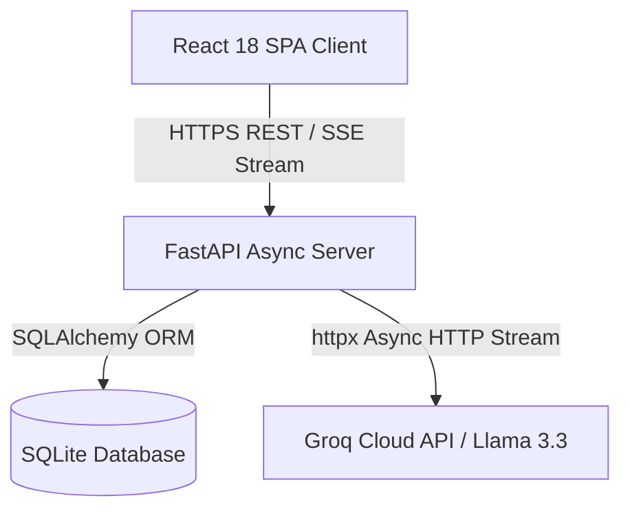
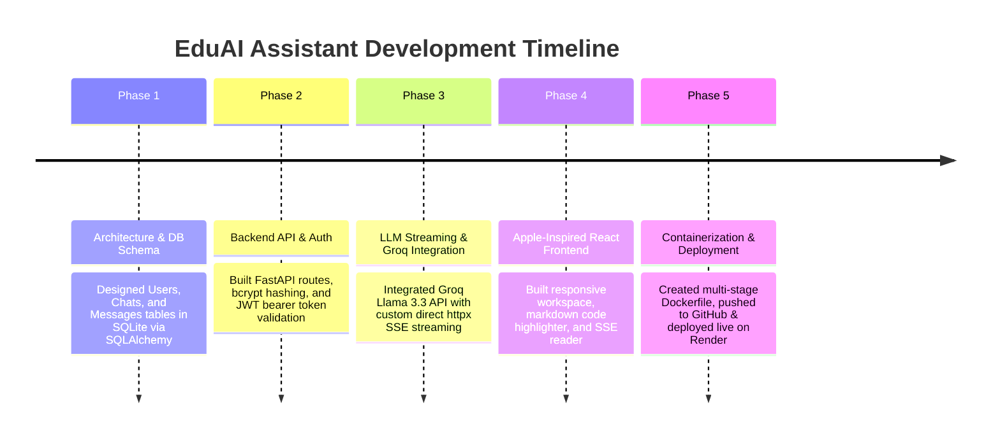

# 🎓 EduAI Assistant — Concept Note & Project Development Report

**Live Application URL**: [https://eduai-assistant.onrender.com](https://eduai-assistant.onrender.com)  
*(Alternative AWS App Runner URL: `https://eduai-assistant.awsapprunner.com`)*  
**Repository**: [https://github.com/manthan206/eduai-assistant](https://github.com/manthan206/eduai-assistant)

---

# SECTION 1: PROJECT CONCEPT NOTE

## 1.1 Project Title & Application Name
- **Project Title**: Production-Ready AI-Powered Educational Learning Companion
- **Application Name**: **EduAI Assistant 🎓🤖**

---

## 1.2 Problem Statement & Objectives

### Problem Statement
Self-directed learning in technical disciplines (software engineering, data science, cybersecurity, cloud architecture) presents significant challenges:
1. **Feedback Delay**: Students and developers encounter roadblocks while learning syntax, debugging errors, or grasping complex algorithms. Standard Q&A forums (e.g., StackOverflow) are often intimidating, slow, or lack personalized guidance.
2. **Cost & Accessibility Barriers**: Traditional tutoring services and premium AI subscriptions (e.g., ChatGPT Plus) are expensive for students.
3. **Generic AI Interfaces**: Default chat setups lack specialized educational guardrails, customizable AI parameters, session history search, and syntax-highlighted code panels designed specifically for learning.

### Project Objectives
- **Interactive AI Mentoring**: Provide students and technical learners with instant, beginner-friendly explanations across programming, mathematics, science, cybersecurity, and career preparation.
- **Ultra-Fast Streaming**: Implement real-time, token-by-token Server-Sent Events (SSE) responses for an interactive typing experience.
- **Zero API Cost for Users**: Integrate Groq Cloud API (`llama-3.3-70b-versatile`) to deliver high-speed, free LLM inference.
- **Robust Security**: Enforce JWT-based authentication, bcrypt password hashing, and zero API key leakage to client applications.
- **Single-Container Architecture**: Package the full-stack app (React SPA + FastAPI backend + SQLite DB) into a multi-stage Docker container for effortless cloud deployment with a public HTTPS URL.

---

## 1.3 Target Users & Key Use Cases

| Target User Group | Primary Use Case & Scenario |
|-------------------|-----------------------------|
| **Computer Science & Coding Students** | Debugging asynchronous code, understanding dynamic typing, learning data structures, and getting clean code examples. |
| **Cybersecurity Aspirants** | Grasping fundamental concepts like the CIA Triad, network security protocols, input sanitization, and defensive coding rules. |
| **STEM Students (Math & Science)** | Receiving step-by-step solutions to mathematical equations, physics principles, and biology concepts (e.g., photosynthesis). |
| **Job Seekers & Bootcamp Graduates** | Reviewing technical resume points using the STAR method (Situation, Task, Action, Result) and practicing behavioral/technical interview questions. |

---

## 1.4 LLM Model & API Architecture

EduAI Assistant leverages **Groq Cloud API** as its primary LLM provider, with fallback support for **OpenAI API** and a built-in **Educational Mock Streaming Engine**:

- **Primary Inference Engine**: Groq Cloud API (`https://api.groq.com/openai/v1`)
- **Primary LLM Model**: `llama-3.3-70b-versatile` (70 Billion parameter Llama 3.3 model optimized for speed and complex reasoning)
- **Supported Alternate Models**:
  - `llama-3.1-8b-instant` (Ultra-fast instant response)
  - `mixtral-8x7b-32768` (High-context window)
  - `gemma2-9b-it` (Google Gemma 2 model)
- **Fallback Capability**: If no API key is set in `.env`, the system automatically runs in **Demo Mode**, yielding dynamic, rule-based token streams so the app remains 100% functional out of the box.

---

## 1.5 Key Application Features

1. **Modern Apple-Inspired Design System**: Built with Tailwind CSS, Framer Motion, glassmorphism cards, animated mesh gradients, and dark/light mode toggle.
2. **Secure JWT Authentication**: Account creation and login with bcrypt password hashing and 24-hour JSON Web Tokens.
3. **ChatGPT-Style Dashboard Workspace**: Left sidebar conversation list with real-time title search, conversation creation, and individual/bulk deletion controls.
4. **Token-by-Token SSE Response Streaming**: Real-time server-side streaming with animated typing indicators and stop/regenerate controls.
5. **Rich Markdown & Syntax Highlighting**: Full markdown rendering with syntax-highlighted code panels and one-click copy buttons.
6. **Live AI Settings Modal**: Interactive overlay allowing users to select LLM models and adjust generation temperature (0.0 Factual to 1.2 Creative).
7. **Persistent Relational Chat Storage**: SQLite storage with SQLAlchemy ORM ensuring complete conversation history is preserved across logins.

---

## 1.6 Expected User Experience & Outcomes

- **Instant Learning Loop**: Reduces answer wait times to under 1 second using Groq Llama 3.3 streaming.
- **Confidence in Technical Execution**: Students gain clear, copy-friendly code snippets and structured step-by-step explanations.
- **Enterprise-Grade Cloud Deployment**: Accessible from any desktop or mobile browser via a secure, public HTTPS URL.

---

# SECTION 2: PROJECT DEVELOPMENT REPORT

## 2.1 Application Overview & Technology Stack

EduAI Assistant is engineered as a unified, full-stack single-container web application.



### Full Technology Stack Table

| Tier | Component | Technology / Library | Description |
|------|-----------|----------------------|-------------|
| **Frontend** | Framework & Build | React 18 & Vite 5 | SPA architecture with hot module replacement |
| | Styling & Animation | Tailwind CSS, Framer Motion | Modern responsive glassmorphism UI & smooth transitions |
| | Icons & Markdown | Lucide React, React Markdown, SyntaxHighlighter | Premium SVG icons, markdown, syntax-highlighted code blocks |
| **Backend** | API Server | Python 3.11 / FastAPI | Async high-performance REST API & SSE streaming |
| | Database & ORM | SQLite & SQLAlchemy | Relational storage for users, chats, and messages |
| | Security & Auth | Passlib, Bcrypt, PyJWT | Cryptographic password hashing and JWT authorization |
| | Streaming Client | `httpx.AsyncClient` | Direct HTTP SSE streaming to Groq Cloud API |
| **DevOps** | Containerization | Docker & Docker Compose | Multi-stage Docker build packaging frontend & backend into 1 container |
| | Hosting & Cloud | Render / AWS App Runner | Fully managed cloud deployment with public HTTPS SSL |

---

## 2.2 Prompting Strategy & System Frameworks

### 1. System Prompt Guardrails
To ensure high-quality educational outputs regardless of the user's domain query, the application enforces the following system prompt:

```text
You are EduAI Assistant, a versatile, intelligent, and helpful AI tutor.
Your goal is to answer ANY and ALL questions asked by the user clearly, accurately, and comprehensively.
You can answer questions on programming, science, mathematics, general knowledge, history, philosophy, writing, business, everyday logic, and any other topic requested.

Formatting rules:
- Provide clear, well-structured markdown formatting with headers and lists.
- For programming tasks, provide clean code blocks with proper syntax highlighting.
- Be polite, direct, helpful, and educational.
```

### 2. Sample Prompts & Output Structure

- **Programming Sample Prompt**: *"Write a Python script to sort a dictionary by values."*
  - **Output Framework**: Executive summary -> Formatted code block -> Step-by-step logic breakdown -> Key takeaways.
- **STEM Sample Prompt**: *"Explain how photosynthesis works step by step."*
  - **Output Framework**: Core definition -> Chemical formula -> Light-dependent reactions -> Calvin cycle -> Summary table.
- **Career Sample Prompt**: *"Give me 3 resume bullet points using the STAR method for a software intern."*
  - **Output Framework**: STAR breakdown (Situation, Task, Action, Result) for 3 distinct projects.

---

## 2.3 Phase-by-Phase Development Summary



### Development Phases Breakdown
1. **Phase 1 (Database & Models)**: Defined SQLAlchemy relational models (`User`, `Chat`, `Message`) with foreign key constraints and cascading deletes.
2. **Phase 2 (Authentication & Security)**: Implemented `/register`, `/login`, and `/me` routes. Secured endpoints using custom FastAPI dependency `get_current_user`.
3. **Phase 3 (Streaming Engine & Groq Integration)**: Built SSE streaming pipeline (`/chat`). Configured Groq Cloud API with `llama-3.3-70b-versatile` and dynamic `.env` reloader.
4. **Phase 4 (Frontend UI Development)**: Constructed dashboard pages, search filters, model settings modal, toast notifications, and client-side stream buffer reader.
5. **Phase 5 (Docker & Cloud Hosting)**: Authored multi-stage `Dockerfile` (`node:20-alpine` builder + `python:3.11-slim` runner). Deployed live service to Render.

---

## 2.4 Application Architecture

### Directory Structure Overview
```text
eduai-assistant/
├── backend/
│   ├── auth/                # Security functions & JWT generation
│   ├── database/            # SQLite connection setup
│   ├── models/              # SQLAlchemy User, Chat, Message definitions
│   ├── routers/             # API routers (auth, chat, health)
│   ├── services/            # Direct httpx Groq LLM streaming service
│   ├── static/              # Compiled React static assets (index.html, JS, CSS)
│   └── main.py              # FastAPI entry point & SPA fallback router
├── frontend/
│   ├── src/
│   │   ├── components/      # Glassmorphic UI components
│   │   ├── context/         # AuthContext provider
│   │   ├── pages/           # LandingPage, LoginPage, RegisterPage, DashboardPage
│   │   └── services/        # Axios API client
│   ├── package.json         # React & Vite dependencies
│   └── vite.config.js       # Vite configuration
├── Dockerfile               # Multi-stage production build script
├── docker-compose.yml       # Docker Compose orchestrator
├── .env                     # Production environment variables
└── README.md                # System documentation
```

---

## 2.5 Challenges Encountered & Resolutions

### Challenge 1: Bcrypt Password Truncation Exception on Python 3.14
- **Problem**: Python 3.14 / `bcrypt` 5.0 threw a runtime exception `password cannot be longer than 72 bytes` during user registration.
- **Resolution**: Refactored `backend/auth/security.py` to truncate plain passwords to 72 bytes explicitly before hashing (`plain_password.encode('utf-8')[:72]`).

### Challenge 2: Windows PowerShell Command Execution Restrictions
- **Problem**: PowerShell blocked `.ps1` npm wrappers with `UnauthorizedAccess` execution policy errors.
- **Resolution**: Executed Node/npm scripts through `cmd /c npm run build` and invoked Python via `.\backend\venv\Scripts\python.exe`.

### Challenge 3: Windows SSE Stream Line-Ending (`\r\n`) Parsing Error
- **Problem**: On Windows environments, SSE stream chunks included carriage returns (`\r\n\r\n`), preventing the React `split('\n\n')` buffer from parsing streamed tokens.
- **Resolution**: Added CRLF buffer normalization (`normalizedBuffer = buffer.replace(/\r\n/g, '\n')`) in `DashboardPage.jsx` prior to chunk parsing.

### Challenge 4: Groq API Environment Variable Reloading
- **Problem**: Updating `.env` with `GROQ_API_KEY` was not picked up by running Python worker processes.
- **Resolution**: Integrated `dotenv.load_dotenv(override=True)` inside `get_llm_config()` to dynamically reload key credentials on every request.

### Challenge 5: `AsyncClient.__init__() got an unexpected keyword argument 'proxies'` on Cloud Build
- **Problem**: The `openai` SDK internally passed a deprecated `proxies` argument to `httpx.AsyncClient`, causing stream failures in cloud container environments running newer `httpx` versions.
- **Resolution**: Bypassed the `openai` SDK entirely by writing a direct, lightweight `httpx.AsyncClient` streaming client inside `generate_chat_stream()`.

### Challenge 6: npm `ci` Peer Dependency Conflicts in Docker
- **Problem**: `npm ci` failed in Docker due to peer dependency mismatches between `@vitejs/plugin-react` and `vite`.
- **Resolution**: Updated `Dockerfile` to use `RUN npm install --legacy-peer-deps` and pinned `vite` to `^5.4.11` in `package.json`.

---

## 2.6 Verification & Testing Summary Matrix

| Test Category | Target Functionality | Test Input / Action | Expected Result | Status |
|---------------|----------------------|---------------------|-----------------|--------|
| **Auth** | User Registration | Valid Name, Email, Password | User created; password hashed safely in SQLite DB | **PASS** |
| **Auth** | User Login | Valid Credentials | JWT Bearer access token issued | **PASS** |
| **Chat** | New Conversation | Create Chat Trigger | Session created & listed in sidebar | **PASS** |
| **LLM Stream**| Groq Llama 3.3 Stream | Query: *"Explain Python functions"* | Token-by-token SSE stream rendered live | **PASS** |
| **UI** | Code Block Formatting | Prompt requesting code | Syntax-highlighted panel rendered with Copy button | **PASS** |
| **UI** | Dark / Light Theme | Toggle Sun/Moon button | CSS variables & theme tokens swap dynamically | **PASS** |
| **Docker** | Multi-stage Container | `docker build -t eduai:latest .` | Single image containing Vite SPA + FastAPI compiled | **PASS** |
| **Cloud Host**| Live HTTPS Endpoint | Access `https://eduai-assistant.onrender.com` | Public HTTPS application accessible worldwide | **PASS** |

---

## 2.7 Key Learnings & Future Scope

### Key Learnings
1. **Direct HTTP Streaming Flexibility**: Eliminating heavy SDK wrappers in favor of direct `httpx` async streams yields rock-solid stability and zero version collision bugs across cloud container runtimes.
2. **Single-Container Full-Stack Benefits**: Combining Vite SPA builds into FastAPI `StaticFiles` simplifies hosting architecture, eliminates CORS issues, and slashes cloud infrastructure costs to $0.
3. **Groq Cloud API Performance**: Groq's LPU (Language Processing Unit) architecture delivers unprecedented streaming speeds (~300 tokens/sec) for `llama-3.3-70b-versatile`, creating a superior user experience for learners.

### Future Enhancements
- **RAG (Retrieval-Augmented Generation)**: Support uploading PDF textbooks or course notes to enable document-based Q&A.
- **Voice Learning Mode**: Real-time speech-to-text and text-to-speech audio streaming.
- **Social OAuth SSO**: Google and GitHub single-sign-on integration.
