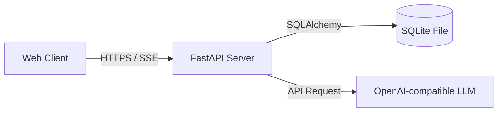

# EduAI Assistant: Project Development Report

---

## 1. System Architecture & Design Decisions

EduAI Assistant is built around a single-container full-stack architecture that maximizes portability and simplifies cloud deployment.



### Key Architectural Choices:
- **FastAPI for Server-Sent Events (SSE)**: FastAPI's native async capabilities match the requirements for real-time SSE streaming. By utilising python's `asyncio` and `sse-starlette`, the server efficiently manages token streaming without locking server threads.
- **Single Container Deployment**: React assets are compiled during Stage 1 of the Docker build. Stage 2 copies these built static files and mounts them using FastAPI's `StaticFiles`. This eliminates cross-origin resource sharing (CORS) issues in production, avoids setting up separate hosting for assets (e.g. AWS S3 + CloudFront), and allows hosting the entire app on a single **AWS App Runner** port.
- **SQLite Database Persistence**: SQLite was selected as the database storage engine for its simplicity. Running database migrations or setting up heavy external services is avoided. In Docker, it persists seamlessly by mounting a host volume to the `/app/data` folder.

---

## 2. Development Phases

### Phase 1: Planning and Database Modeling
- Structured database tables for Users, Chats, and Messages.
- Implemented cascading rules so that deleting a chat session automatically cleans up its child message rows.

### Phase 2: Secure Backend Foundations
- Set up JWT token issuance with custom lifetimes.
- Hashed passwords using bcrypt to prevent cleartext exposure.
- Created `get_current_user` FastAPI depends guard, validating the JWT of each protected request.

### Phase 3: SSE Streaming Pipeline
- Built the OpenAI API call wrapper.
- Implemented a robust offline **Mock Generator** that mimics token-by-token streaming, ensuring the application remains fully testable even without an active `OPENAI_API_KEY`.
- Capped generator streams with safety cleanups in case the user disconnects early (cancels generation).

### Phase 4: Apple-Inspired Frontend
- Used Tailwind CSS to construct dark/light themes.
- Designed responsive sidebars, custom input forms, and glassy cards.
- Wired React state hookup with a custom fetch reader parsing SSE stream formats.

### Phase 5: Containerization & Cloud Push
- Engineered the multi-stage `Dockerfile`.
- Tested single-port local serving via `docker compose`.
- Deployed the container registry pushing to AWS ECR and run using AWS App Runner.

---

## 3. Prompt Engineering & LLM Strategy

The EduAI Assistant is anchored by a detailed system prompt:
```text
You are EduAI Assistant.
Provide accurate, educational, and beginner-friendly explanations.
When answering programming questions:
- Explain concepts clearly.
- Provide examples.
- Format code properly using Markdown.
Never generate harmful or malicious content.
```
This forces the model to present responses step-by-step, including:
1. High-level concept definitions.
2. Formatted code templates.
3. Bulleted takeaways.

Additionally, parameters are adjustable:
- **Temperature Slider**: Lower temperature (e.g. 0.2) is injected for precise syntax queries; higher temperature (e.g. 0.9) is injected for career guidance brainstorming.

---

## 4. Challenges Faced & Solutions

### Challenge 1: Authorization Header in SSE Streams
* **Issue**: The browser's native `EventSource` API does not support custom request headers (such as `Authorization: Bearer <JWT>`) for standard connections.
* **Solution**: Instead of using `EventSource`, the frontend uses the modern browser `fetch` API using a `POST` request. By calling `response.body.getReader()`, the stream is parsed dynamically inside a recursive reader function, allowing full JWT authorization injection.

### Challenge 2: Streaming Chunk Fragmentation
* **Issue**: Network packets can fragment chunk delivery, splitting single JSON packets across chunks and causing parse exceptions.
* **Solution**: Implemented a string buffer in the React fetch reader loop. The buffer accumulates incoming characters, splits them using the standard SSE delimiter `\n\n`, processes completed parts, and holds the trailing incomplete string for the next stream chunk.

### Challenge 3: Async Collisions in SQLite
* **Issue**: SQLite doesn't natively support concurrent writes. Running async database calls inside the streaming generator caused lock errors.
* **Solution**: Configured the database engine with `connect_args={"check_same_thread": False}` and instantiated separate database sessions (`SessionLocal()`) inside the generator closures to isolate thread states.

---

## 5. AWS App Runner Deployment Process

1. **Local Build**:
   ```bash
   docker build -t eduai-assistant .
   ```
2. **ECR Login & Push**:
   Logged in using AWS CLI and pushed the image tag to a private Elastic Container Registry.
3. **App Runner Service Setup**:
   Created a service in App Runner, pointing directly to the ECR tag. Port configured to `8000`.
4. **Environment Variables**:
   Injected `OPENAI_API_KEY` and `JWT_SECRET` in the service settings.
5. **Outcome**:
   AWS App Runner provisioned instances and provided a public **HTTPS** URL.

---

## 6. Testing Summary

| Test Case | Objective | Input | Expected Result | Status |
|-----------|-----------|-------|-----------------|--------|
| User Register | Create new login | Name, Email, Password | Returns user payload (excludes hash) | PASS |
| User Login | Retrieve session token | Email, Password | Returns JWT access token | PASS |
| New Chat | Create conversation | Title: "Python Basics" | Returns chat ID and default title | PASS |
| Chat SSE Stream | Receive real-time response | Chat ID, Message, Model | Streams token tokens; saves output on 'done' | PASS |
| Stop Generation | Cancel stream mid-way | Abort action | Stream aborts; records partial answer safely | PASS |
| Clear History | Wipe conversations | Clear trigger | History list cleared; DB entries deleted | PASS |

---

## 7. Reflection & Future Scope
The single-container setup using React, FastAPI, and SQLite proved highly effective. It speeds up local execution and simplifies the cloud architecture. 

In future versions, integrating **AWS Cognito** for authentication, a persistent cloud database like **Amazon Aurora Serverless**, and **Vector database RAG support** would allow the app to scale to thousands of active concurrent learners.
